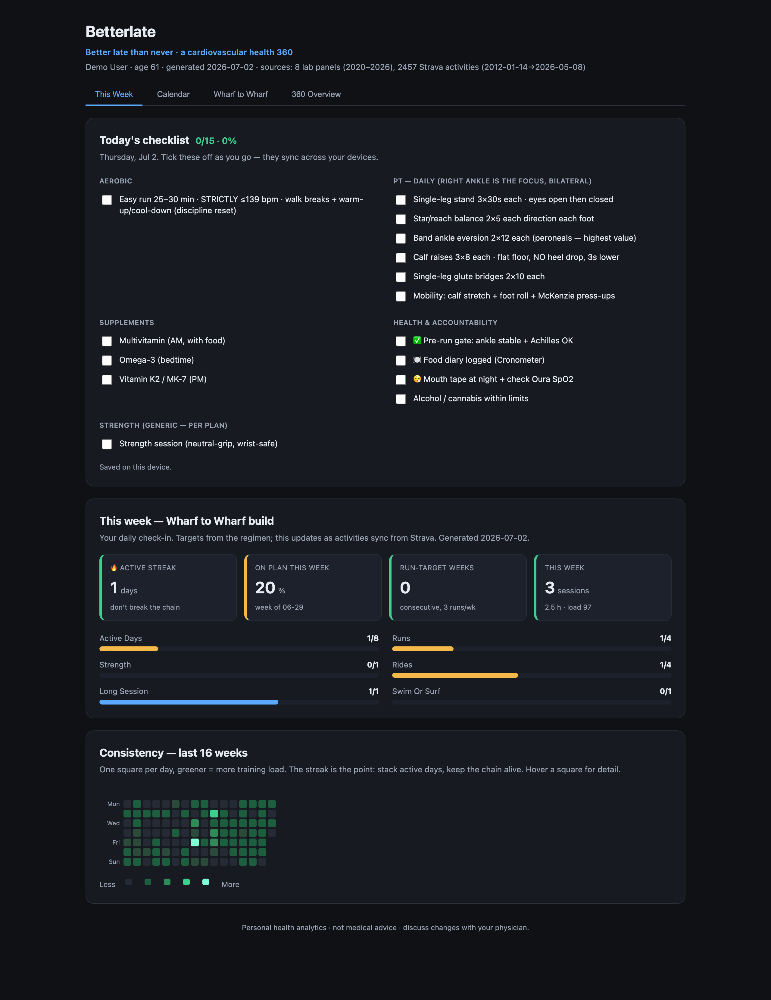
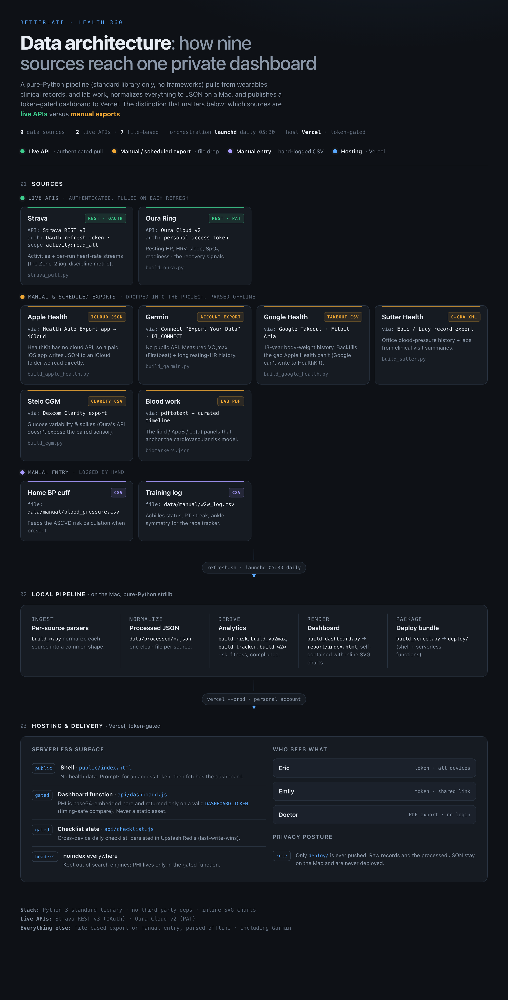

# Betterlate

A self-hosted, **token-gated personal health dashboard** that pulls from your wearables, clinical records, and lab work, normalizes everything to JSON, and renders a single private "health 360" view focused on cardiovascular risk and training.

Pure Python 3 standard library. **No dependencies, no framework, no build step.** Every chart is inline SVG in a single self-contained HTML file.

> Not medical advice. This is a personal analytics tool. Discuss any changes with your physician.



*Rendered entirely from the bundled synthetic demo data. Drop in your own and it takes over automatically.*

---

## Why

Your health data is scattered across a dozen apps that do not talk to each other: Strava has your workouts, Oura has your sleep, your doctor's portal has your labs, a scale app has your weight. Betterlate ingests all of them into one place you control, and publishes it privately so only you (and whoever you share a token with) can see it.

The one distinction the architecture is built around: **which sources are live APIs versus manual exports.** Most consumer health data has no usable API, so the pipeline treats file exports as first-class citizens.



---

## Data sources

| Source | Connection | What it adds |
|--------|-----------|--------------|
| Strava | **Live API** (REST v3, OAuth) | Activities + per-run heart-rate streams |
| Oura | **Live API** (Cloud v2, token) | Resting HR, HRV, sleep, SpO₂, readiness |
| Apple Health | Export (Health Auto Export app → iCloud JSON) | Steps, walking speed, weight, resting HR |
| Garmin | Export (Connect "Export Your Data") | Measured VO₂max, resting-HR history |
| Google Health / Fitbit | Export (Google Takeout) | Long body-weight history |
| Clinical records | Export (Epic/Lucy C-CDA XML) | Office blood pressure + labs |
| CGM (Dexcom/Stelo) | Export (Clarity CSV) | Glucose variability and spikes |
| Blood work | Lab PDF → curated JSON | Lipids, ApoB, Lp(a), A1c |
| Manual | Hand-logged CSV | Home BP, training notes |

Every source is optional. The dashboard renders whatever is present and skips the rest.

---

## Quick start (demo)

The repo ships with **synthetic sample data**, so you get a working dashboard with zero setup:

```bash
git clone https://github.com/YOUR_USER/betterlate.git
cd betterlate
python3 code/build_dashboard.py
open report/index.html      # or xdg-open / start
```

You will see a full dashboard rendered from fake numbers in `sample/processed/`. All values are synthetic and for illustration only.

---

## Use your own data

Once you drop real data in `data/processed/`, the dashboard uses it instead of the samples automatically.

**1. Live APIs**

- **Strava**: create an API application at <https://www.strava.com/settings/api>, complete the OAuth flow with the `activity:read_all` scope to get a refresh token, then copy `setup/strava_api.json.example` to `data/strava-live/strava_api.json` and fill it in.
- **Oura**: create a personal access token at <https://cloud.ouraring.com/personal-access-tokens>, then copy `setup/oura_token.txt.example` to `data/oura/token.txt`.

**2. File-export sources**

Drop the export from each service into the folder its parser expects (see the docstring at the top of each `code/build_*.py`), then run that parser.

**3. Build**

```bash
./code/refresh.sh          # pulls live APIs, runs every parser, rebuilds, (optionally) deploys
```

Or run any single step, e.g. `python3 code/build_oura.py`, then `python3 code/build_dashboard.py`.

---

## Deploy privately (token-gated)

`build_vercel.py` packages the dashboard so your health data is **never in a public file**:

- `public/index.html` is a shell with no data. It prompts for a token.
- `api/dashboard.js` holds the dashboard base64-embedded and returns it only when the request carries the correct token (a Vercel env var, timing-safe compared). It is a serverless function, not a static asset.
- `api/checklist.js` persists a daily checklist across devices via a Redis KV store.

```bash
python3 code/build_vercel.py
cd deploy
vercel                                    # first deploy (choose your personal account)
vercel env add DASHBOARD_TOKEN            # set a strong token (openssl rand -base64 24)
vercel --prod
```

Share the URL plus the token with anyone you want to give access. Rotate the token any time by resetting the env var and redeploying.

---

## Privacy model

- **Only `deploy/` is ever published.** Raw records and your processed JSON stay on your machine and are git-ignored.
- **PHI lives only inside the gated serverless function**, returned solely on a valid token.
- `noindex` headers keep it out of search engines.
- The `.gitignore` excludes `data/`, `report/`, `deploy/`, and all credential files by default. **Verify before your first push** that `git status` shows none of your real data.

---

## Project layout

```
code/               the pipeline (pure Python stdlib)
  strava_pull.py      live Strava pull (OAuth)
  build_oura.py       live Oura pull
  build_*.py          one parser per source -> data/processed/*.json
  build_risk.py       cardiovascular risk model (ASCVD + enhancers)
  build_dashboard.py  renders report/index.html (inline SVG)
  build_vercel.py     packages the token-gated deploy/ bundle
  refresh.sh          orchestrates the whole pipeline
sample/processed/   synthetic demo data (committed, safe)
setup/              credential templates
docs/               architecture diagram
data/               YOUR real data (git-ignored)
```

---

## License

MIT. See [LICENSE](LICENSE). The copyright line is a placeholder; put your own name or handle there if you like.
